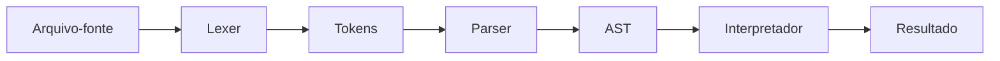
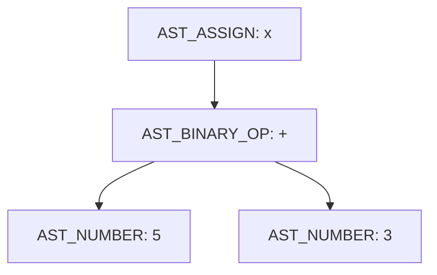

# Atividade Individual — Análise do Mini C Compiler

## Disciplina de Compiladores

**Modalidade:** atividade prática individual  
**Repositório analisado:** [ironrinox/mini-c-compiler](https://github.com/ironrinox/mini-c-compiler)  
**Forma de entrega:** repositório individual no GitHub, relatório em Markdown e apresentação prática  
**Valor:** 10,0 pontos  
**Data de entrega:** 14/08 - iniciar em sala - 2/5 pontos  - 21/08 - apresentar pitch e entrega em repos (o aluno deverar criar seu repos com os artefatos criados e liberar link via e-mail para o professor) - 3/5 pontos,  total 5 pontos de 50% da P2, os outros 50% serão do projeto integrador.

---

## 1. Apresentação da atividade

Nesta atividade, cada estudante analisará o projeto **Mini C Compiler**, desenvolvido em linguagem C e disponibilizado publicamente no GitHub.

O objetivo não é apenas executar o projeto ou descrever seus arquivos. O estudante deverá acompanhar o caminho percorrido por um programa desde a leitura do arquivo-fonte até a apresentação do resultado, relacionando o código do repositório aos conceitos estudados na disciplina.

Ao final da atividade, o estudante deverá ser capaz de explicar o seguinte fluxo:



> **Atenção:** apesar de o projeto utilizar o nome *Mini C Compiler*, sua versão atual funciona como um **interpretador**. Ele constrói uma AST e a executa diretamente, sem gerar código de máquina, assembly ou bytecode. Essa constatação deverá ser explicada no relatório.

---

## 2. Objetivos de aprendizagem

Ao realizar a atividade, o estudante deverá:

- compreender a organização básica de um projeto de compiladores;
- identificar o ponto de entrada do programa;
- explicar o funcionamento do analisador léxico;
- identificar os tokens reconhecidos pela linguagem;
- explicar como o parser constrói a AST;
- interpretar a representação impressa da AST;
- compreender o funcionamento da tabela de símbolos;
- diferenciar erros léxicos, sintáticos e de execução;
- diferenciar compilador, interpretador e transpiler;
- identificar limitações existentes no projeto;
- implementar e testar uma pequena melhoria individual.

---

## 3. Funcionalidades atuais do projeto

A linguagem experimental reconhece:

- declaração e atribuição de variáveis com `let`;
- comando de saída `print`;
- números inteiros;
- identificadores;
- operadores `+`, `-`, `*` e `/`;
- parênteses;
- ponto e vírgula ao final dos comandos.

Exemplo:

```c
let x = 5 + 3;
let y = 1 + 1;
print(x + y);
```

Saída esperada:

```text
10
```

---

## 4. Preparação do ambiente

### 4.1 Requisitos

O estudante deverá possuir:

- Git instalado;
- GCC, Clang ou outro compilador C compatível;
- terminal ou prompt de comandos;
- editor de código;
- conta no GitHub.

Para verificar as instalações, execute:

```bash
git --version
gcc --version
```

### 4.2 Obtenção do projeto

O estudante poderá criar um **fork** do repositório na própria conta do GitHub ou cloná-lo e depois publicar sua versão em um repositório individual.

Para clonar o projeto original:

```bash
git clone https://github.com/ironrinox/mini-c-compiler.git
cd mini-c-compiler
```

### 4.3 Compilação

Na raiz do projeto, execute:

```bash
gcc src/main.c src/lexer.c src/parser.c src/interpreter.c src/utils.c -Iinclude -o mini-c
```

No Windows, o arquivo produzido poderá aparecer como `mini-c.exe`.

### 4.4 Execução

Linux ou macOS:

```bash
./mini-c examples/test.txt
```

Windows PowerShell:

```powershell
.\mini-c.exe examples\test.txt
```

O programa deverá apresentar:

1. o código-fonte lido;
2. a lista de tokens;
3. a AST;
4. o resultado da execução.

> Caso o projeto não compile, registre a mensagem de erro, verifique se o GCC está instalado e confirme se o terminal está aberto na raiz do repositório.

---

## 5. Estrutura que deverá ser analisada

Os principais arquivos são:

| Arquivo | Responsabilidade principal |
|---|---|
| `src/main.c` | Coordena todo o fluxo do programa |
| `src/utils.c` | Lê o conteúdo do arquivo-fonte |
| `include/lexer.h` | Define os tipos e estruturas dos tokens |
| `src/lexer.c` | Transforma caracteres em tokens |
| `include/parser.h` | Define os tipos e a estrutura dos nós da AST |
| `src/parser.c` | Constrói e imprime a AST |
| `include/interpreter.h` | Define a tabela de símbolos e as funções do interpretador |
| `src/interpreter.c` | Percorre a AST e executa o programa |
| `examples/test.txt` | Contém um programa de exemplo |

O estudante deverá conferir essa organização diretamente no repositório e complementar a tabela com as principais funções encontradas em cada arquivo.

---

## 6. Etapa 1 — Análise do ponto de entrada

Abra o arquivo `src/main.c` e localize a função:

```c
int main(int argc, char* argv[])
```

Analise a sequência de chamadas:

```c
read_file(...)
lex(...)
parse(...)
interpret(...)
```

No relatório, responda:

1. Como o caminho do arquivo-fonte é recebido?
2. O que acontece quando nenhum arquivo é informado?
3. Qual função lê o arquivo?
4. Qual função realiza a análise léxica?
5. Qual função constrói a AST?
6. Qual função executa a AST?
7. Em que ordem essas funções são chamadas?

Inclua um pequeno trecho de `main.c` e explique-o com suas próprias palavras. Não copie o arquivo completo.

---

## 7. Etapa 2 — Análise da leitura do arquivo

Abra `src/utils.c` e analise a função `read_file`.

Observe que ela:

1. abre o arquivo com `fopen`;
2. descobre o tamanho com `fseek` e `ftell`;
3. reserva memória com `malloc`;
4. lê o conteúdo com `fread`;
5. acrescenta `\0` ao final da string;
6. fecha o arquivo;
7. devolve o conteúdo para `main`.

No relatório, explique:

- por que é necessário reservar memória;
- qual é o papel do caractere `\0`;
- o que acontece quando o arquivo não existe;
- quem é responsável por liberar a memória reservada.

---

## 8. Etapa 3 — Análise léxica

Abra `include/lexer.h` e identifique o `enum TokenType`.

Os tokens reconhecidos incluem:

```text
T_NUMBER
T_PLUS
T_MINUS
T_MULT
T_DIV
T_LET
T_IDENTIFIER
T_EQUAL
T_PRINT
T_SEMICOLON
T_LPAREN
T_RPAREN
T_EOF
```

Depois, abra `src/lexer.c` e analise a função:

```c
TokenList lex(const char* source)
```

### 8.1 O que deverá ser observado

- espaços são ignorados com `isspace`;
- números são reconhecidos com `isdigit`;
- palavras são reconhecidas com `isalpha` e `isalnum`;
- `let` e `print` são tratados como palavras reservadas;
- os demais nomes são identificadores;
- operadores e pontuações são reconhecidos por um `switch`;
- um caractere desconhecido encerra o programa;
- `T_EOF` é inserido ao final da lista.

### 8.2 Teste léxico obrigatório

Crie o arquivo `testes/01_lexico_valido.txt`:

```c
let valor1 = 123 + 4;
print(valor1);
```

Execute o programa e registre os tokens apresentados.

Depois, crie `testes/02_lexico_invalido.txt`:

```c
let valor = 10 @ 2;
```

Registre:

- a mensagem produzida;
- o caractere que causou o erro;
- o arquivo e a função responsáveis pela detecção;
- a classificação do erro.

### 8.3 Perguntas obrigatórias

1. Como o lexer diferencia `let` de um identificador comum?
2. Como um número com vários dígitos é construído?
3. Identificadores como `nota1` são aceitos?
4. Identificadores iniciados por número são aceitos?
5. O lexer registra linha e coluna?
6. Existe limite para a quantidade de tokens?
7. O que pode ocorrer se o programa gerar mais de 128 tokens?

---

## 9. Etapa 4 — Análise sintática

Abra `src/parser.c` e localize:

```c
parse(...)
parse_statement(...)
parse_expression(...)
create_node(...)
```

O parser recebe a lista de tokens e constrói uma Árvore Sintática Abstrata.

### 9.1 Formas reconhecidas

Declaração:

```text
let IDENTIFICADOR = EXPRESSAO ;
```

Impressão:

```text
print ( EXPRESSAO ) ;
```

Expressões:

```text
NUMERO
IDENTIFICADOR
( EXPRESSAO )
EXPRESSAO OPERADOR EXPRESSAO
```

### 9.2 Testes sintáticos obrigatórios

Crie `testes/03_sintatico_valido.txt`:

```c
let resultado = (10 + 5) * 2;
print(resultado);
```

Crie `testes/04_sem_igual.txt`:

```c
let resultado 10 + 5;
```

Crie `testes/05_sem_ponto_virgula.txt`:

```c
let resultado = 10 + 5
```

Crie `testes/06_parentese_incompleto.txt`:

```c
print((10 + 5);
```

Para cada teste, registre:

- resultado esperado;
- resultado observado;
- mensagem apresentada;
- posição informada pelo parser;
- função responsável pela detecção.

---

## 10. Etapa 5 — Análise da AST

Abra `include/parser.h` e analise:

```c
typedef enum {
    AST_NUMBER,
    AST_BINARY_OP,
    AST_VAR,
    AST_ASSIGN,
    AST_PRINT
} ASTNodeType;
```

Analise também a estrutura `ASTNode`:

```c
typedef struct ASTNode {
    ASTNodeType type;
    int value;
    char name[32];
    struct ASTNode* left;
    struct ASTNode* right;
} ASTNode;
```

### 10.1 Atividade obrigatória

Utilize:

```c
let x = 5 + 3;
print(x);
```

Execute o programa e copie para o relatório a AST impressa. Depois explique:

- qual nó representa a atribuição;
- onde o nome `x` é armazenado;
- quais nós representam os números;
- qual nó representa a soma;
- como os ponteiros `left` e `right` são utilizados.

Represente a árvore em texto ou Mermaid. Exemplo:



---

## 11. Etapa 6 — Tabela de símbolos e interpretação

Abra `include/interpreter.h` e `src/interpreter.c`.

Localize:

```c
init_symbol_table(...)
lookup_symbol(...)
set_symbol(...)
eval_expression(...)
exec_statement(...)
interpret(...)
```

### 11.1 O que deverá ser explicado

- `interpret` percorre os comandos da AST;
- `exec_statement` executa atribuições e impressões;
- `eval_expression` calcula expressões recursivamente;
- `set_symbol` inclui ou atualiza uma variável;
- `lookup_symbol` consulta o valor de uma variável;
- a tabela possui capacidade fixa para 128 símbolos.

### 11.2 Testes obrigatórios

Variável definida:

```c
let idade = 30;
print(idade);
```

Variável não definida:

```c
print(idade);
```

Divisão por zero:

```c
let resultado = 10 / 0;
print(resultado);
```

No relatório, classifique cada falha como:

- erro léxico;
- erro sintático;
- erro semântico detectado durante a execução;
- outro erro de execução.

Explique também por que a variável indefinida somente é detectada pelo interpretador, e não pelo parser.

---

## 12. Etapa 7 — Compilador ou interpretador?

O estudante deverá responder, com justificativa técnica:

> O projeto analisado é atualmente um compilador, um interpretador ou um transpiler?

Considere:

- o projeto produz algum arquivo de saída?
- gera assembly?
- gera bytecode?
- gera código C?
- percorre a AST e calcula os resultados diretamente?

A resposta deverá citar as funções do código que sustentam a conclusão.

---

## 13. Etapa 8 — Investigação de precedência e associatividade

O parser atual utiliza uma implementação recursiva simplificada. O estudante deverá testar se ela respeita corretamente a precedência e a associatividade dos operadores.

Crie os seguintes programas:

### Teste A

```c
print(2 * 3 + 4);
```

Resultado esperado pela aritmética convencional:

```text
10
```

### Teste B

```c
print(10 - 3 - 2);
```

Resultado esperado pela associatividade convencional:

```text
5
```

### Teste C

```c
print(2 + 3 * 4);
```

Resultado esperado:

```text
14
```

Para cada caso:

1. registre o resultado obtido;
2. copie a AST impressa;
3. compare com o resultado esperado;
4. explique a ordem adotada pelo parser;
5. indique se existe problema de precedência ou associatividade.

> Não presuma que o projeto está correto. Uma análise técnica também deve identificar limitações e comportamentos inesperados.

---

## 14. Etapa 9 — Modificação individual obrigatória

Cada estudante deverá implementar **uma melhoria individual**. O professor distribuirá ou aprovará temas diferentes para evitar entregas idênticas.

Possibilidades:

1. adicionar o operador de resto `%`;
2. adicionar o operador de potência;
3. aceitar comentários de uma linha;
4. registrar linha e coluna nos tokens;
5. melhorar as mensagens de erro;
6. adicionar números negativos;
7. criar um comando `print` sem parênteses;
8. adicionar operadores relacionais;
9. corrigir a precedência dos operadores;
10. corrigir a associatividade de `-` e `/`;
11. detectar variável não definida antes da interpretação;
12. adicionar uma função para liberar a AST;
13. tornar a lista de tokens redimensionável;
14. exportar a AST em formato textual ou Graphviz;
15. acrescentar testes automatizados.

### 14.1 O que deverá ser documentado

O relatório deverá informar:

- problema ou limitação escolhida;
- comportamento anterior;
- comportamento desejado;
- arquivos alterados;
- funções alteradas ou criadas;
- decisões de implementação;
- casos de teste;
- resultado obtido;
- limitações que permaneceram.

### 14.2 Commits mínimos

O repositório deverá possuir um histórico progressivo. Sugestão:

```text
docs: registra análise inicial do projeto
test: adiciona casos de teste válidos e inválidos
feat: implementa melhoria individual
test: valida a nova funcionalidade
docs: conclui relatório e instruções de execução
```

Um único commit contendo todo o trabalho deverá ser justificado e poderá exigir defesa complementar.

---

## 15. Casos de teste mínimos

O estudante deverá entregar pelo menos os seguintes testes:

| Identificação | Categoria | Finalidade |
|---|---|---|
| T01 | Válido | Programa original do repositório |
| T02 | Léxico | Caractere desconhecido |
| T03 | Sintático | Ausência de `=` |
| T04 | Sintático | Ausência de `;` |
| T05 | Sintático | Parêntese incompleto |
| T06 | Execução | Variável não definida |
| T07 | Execução | Divisão por zero |
| T08 | Expressão | Precedência de operadores |
| T09 | Expressão | Associatividade de operadores |
| T10 | Extensão | Funcionalidade implementada pelo estudante |

Use esta tabela no relatório:

| ID | Entrada | Resultado esperado | Resultado obtido | Situação |
|---|---|---|---|---|
| T01 | ... | ... | ... | Aprovado/Reprovado |

---

## 16. Organização da entrega

O repositório individual deverá conter, no mínimo:

```text
mini-c-compiler-seunome/
├── README.md
├── RELATORIO.md
├── include/
├── src/
├── examples/
├── testes/
│   ├── 01_lexico_valido.txt
│   ├── 02_lexico_invalido.txt
│   ├── 03_sintatico_valido.txt
│   ├── 04_sem_igual.txt
│   ├── 05_sem_ponto_virgula.txt
│   ├── 06_parentese_incompleto.txt
│   └── demais_testes.txt
└── evidencias/
```

O estudante deverá preservar os créditos e a licença do projeto original.

---

## 17. Estrutura obrigatória do relatório

O arquivo `RELATORIO.md` deverá conter:

1. identificação do estudante;
2. identificação do projeto original;
3. objetivo da atividade;
4. preparação do ambiente;
5. procedimento de compilação e execução;
6. arquitetura e responsabilidades dos arquivos;
7. análise do ponto de entrada;
8. análise da leitura do arquivo;
9. análise léxica;
10. análise sintática;
11. análise da AST;
12. análise da tabela de símbolos;
13. análise do interpretador;
14. classificação do projeto;
15. resultados dos testes;
16. análise de precedência e associatividade;
17. descrição da melhoria individual;
18. limitações encontradas;
19. conclusão;
20. referências.

Extensão sugerida: entre 5 e 10 páginas quando exportado para PDF, sem contar anexos.

---

## 18. Apresentação e defesa individual

Cada estudante realizará uma apresentação de **8 a 10 minutos**, seguida de perguntas do professor.

### Roteiro sugerido

1. apresentar o projeto e sua finalidade;
2. mostrar a estrutura do repositório;
3. explicar o fluxo de `main.c`;
4. executar um programa válido;
5. mostrar tokens e AST;
6. demonstrar um erro léxico;
7. demonstrar um erro sintático;
8. demonstrar um erro de execução;
9. apresentar a limitação de precedência ou associatividade;
10. demonstrar a melhoria individual;
11. mostrar os principais commits;
12. apresentar a conclusão.

Durante a defesa, o professor poderá solicitar:

- explicação de uma função;
- localização do reconhecimento de um token;
- alteração de um caso de teste;
- execução de uma entrada diferente;
- identificação de um nó da AST;
- justificativa de uma decisão de implementação.

---

## 19. Critérios de avaliação

| Critério | Pontuação |
|---|---:|
| Compilação, execução e organização do repositório | 1,0 |
| Mapeamento da arquitetura e do ponto de entrada | 1,0 |
| Análise léxica | 1,0 |
| Análise sintática e AST | 1,5 |
| Tabela de símbolos e interpretação | 1,0 |
| Casos de teste e análise crítica | 1,5 |
| Modificação individual implementada | 2,0 |
| Relatório, commits e documentação | 0,5 |
| Apresentação e defesa individual | 0,5 |
| **Total** | **10,0** |

### Possíveis descontos

- projeto não compila ou não executa sem justificativa: até **−2,0**;
- ausência da melhoria individual: até **−2,0**;
- ausência dos testes obrigatórios: até **−1,5**;
- ausência de referência ao projeto original: até **−1,0**;
- incapacidade de explicar o código alterado: até **−2,0**;
- entrega sem histórico progressivo de commits: solicitação de defesa complementar.

---

## 20. Autoria, referências e uso de ferramentas de IA

O trabalho é individual. Todo código ou texto baseado em fontes externas deverá ser identificado.

O uso de ferramentas de IA deverá respeitar as regras definidas pelo professor. Caso seja permitido, o estudante continuará responsável por:

- compreender o código entregue;
- conferir as respostas geradas;
- testar todas as modificações;
- informar o uso da ferramenta no relatório;
- explicar o trabalho durante a defesa.

Código gerado ou sugerido por uma ferramenta não substitui a compreensão técnica do estudante.

---

## 21. Checklist antes da entrega

### Execução

- [ ] Clonei ou criei um fork do repositório correto.
- [ ] Compilei o projeto em meu ambiente.
- [ ] Executei o exemplo original.
- [ ] Registrei os comandos utilizados.

### Análise

- [ ] Expliquei o fluxo de `main.c`.
- [ ] Analisei `utils.c`.
- [ ] Identifiquei todos os tipos de token.
- [ ] Expliquei o funcionamento do lexer.
- [ ] Expliquei o funcionamento do parser.
- [ ] Analisei e representei uma AST.
- [ ] Expliquei a tabela de símbolos.
- [ ] Expliquei como a AST é interpretada.
- [ ] Classifiquei corretamente o projeto como interpretador em sua versão atual.

### Testes

- [ ] Executei os testes válidos.
- [ ] Provoquei um erro léxico.
- [ ] Provoquei erros sintáticos.
- [ ] Testei variável não definida.
- [ ] Testei divisão por zero.
- [ ] Testei precedência.
- [ ] Testei associatividade.
- [ ] Registrei resultados esperados e obtidos.

### Modificação individual

- [ ] Minha melhoria foi aprovada pelo professor.
- [ ] Documentei o comportamento anterior.
- [ ] Implementei a melhoria.
- [ ] Criei testes para a melhoria.
- [ ] Documentei os arquivos alterados.
- [ ] Mantive um histórico progressivo de commits.

### Entrega

- [ ] Atualizei o `README.md`.
- [ ] Finalizei o `RELATORIO.md`.
- [ ] Organizei a pasta `testes`.
- [ ] Preservei os créditos do projeto original.
- [ ] Confirmei que o link do repositório está acessível.
- [ ] Preparei a apresentação e a demonstração.

---

## 22. Referência principal

IRONRINOX. **Mini C Compiler**. GitHub. Disponível em: <https://github.com/ironrinox/mini-c-compiler>. Acesso em: 14 ago. 2026.

